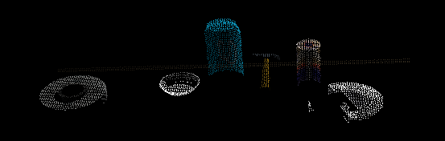

## Project: Perception Pick & Place
### This project demonstrates the pipeline of robotic perception: point cloud downsampling, filtering, clustering, and classification. The pipeline is tested under total of three scenarios: 3 objects, 5 objects, and 8 objects in the scene, respectively. 

[//]: # (Image Reference)

[test1]: ./img/test1.png
[test2]: ./img/test2.png
[test3]: ./img/test3.png
[pcl_leaf_size_001]: ./img/pcl_leaf_size_001.png
[pcl_leaf_size_01]: ./img/pcl_leaf_size_01.png
[no_passthrough_filter]: ./img/no_passthrough_filter.png
[with_passthrough_filter]: ./img/with_passthrough_filter.png
[extracted_inliers]: ./img/extracted_inliers.png
[extracted_outliers]: ./img/extracted_outliers.png

---
## Project Procedures
### Point Cloud Voxel Downsampling
Raw point cloud has too many points for any postprocessing. Hence, we use voxel downsampling to reduce the amount of data points. Here, leaf (aka, voxel size) of 0.01 is used to average the points within each voxel:

![pcl_leaf_size_001]

### Passthrough Filtering
Because we only focus on the objects above the table, we apply passthrough filter to eliminate the points besides the table plank and the objects above it. Through experiment, the optimal range of visibility is between z=0.6 and z=1.1:

![with_passthrough_filter]

### Outlier rejection via RANSAC
RANSAC algorithm is leveraged to fit a model to the data. The data close to the model within certain tolerance are classified as inliers, otherwise as outliers. In our case, we fit a plane to the point cloud after passthrough filtering to obtain the data point for the table. By toggling the parameter in the `cloud_filtered.extract()` function, we can also obtain the data points that represent the objects above the table.

![Inliers: table][extracted_inliers]

1. Extract features and train an SVM model on new objects (see `pick_list_*.yaml` in `/pr2_robot/config/` for the list of models you'll be trying to identify). 
2. Write a ROS node and subscribe to `/pr2/world/points` topic. This topic contains noisy point cloud data that you must work with.
3. Use filtering and RANSAC plane fitting to isolate the objects of interest from the rest of the scene.
4. Apply Euclidean clustering to create separate clusters for individual items.
5. Perform object recognition on these objects and assign them labels (markers in RViz).
6. Calculate the centroid (average in x, y and z) of the set of points belonging to that each object.
7. Create ROS messages containing the details of each object (name, pick_pose, etc.) and write these messages out to `.yaml` files, one for each of the 3 scenarios (`test1-3.world` in `/pr2_robot/worlds/`).  [See the example `output.yaml` for details on what the output should look like.](https://github.com/udacity/RoboND-Perception-Project/blob/master/pr2_robot/config/output.yaml)  
8. Submit a link to your GitHub repo for the project or the Python code for your perception pipeline and your output `.yaml` files (3 `.yaml` files, one for each test world).  You must have correctly identified 100% of objects from `pick_list_1.yaml` for `test1.world`, 80% of items from `pick_list_2.yaml` for `test2.world` and 75% of items from `pick_list_3.yaml` in `test3.world`.
9. Congratulations!  Your Done!

## [Rubric](https://review.udacity.com/#!/rubrics/1067/view) Points
### Here I will consider the rubric points individually and describe how I addressed each point in my implementation.  

---
### Writeup / README

#### 1. Provide a Writeup / README that includes all the rubric points and how you addressed each one.  You can submit your writeup as markdown or pdf.  

You're reading it!

### Exercise 1, 2 and 3 pipeline implemented
#### 1. Complete Exercise 1 steps. Pipeline for filtering and RANSAC plane fitting implemented.

#### 2. Complete Exercise 2 steps: Pipeline including clustering for segmentation implemented.  

#### 2. Complete Exercise 3 Steps.  Features extracted and SVM trained.  Object recognition implemented.
Here is an example of how to include an image in your writeup.

### Pick and Place Setup

#### 1. For all three tabletop setups (`test*.world`), perform object recognition, then read in respective pick list (`pick_list_*.yaml`). Next construct the messages that would comprise a valid `PickPlace` request output them to `.yaml` format.

And here's another image! 

Spend some time at the end to discuss your code, what techniques you used, what worked and why, where the implementation might fail and how you might improve it if you were going to pursue this project further.  

